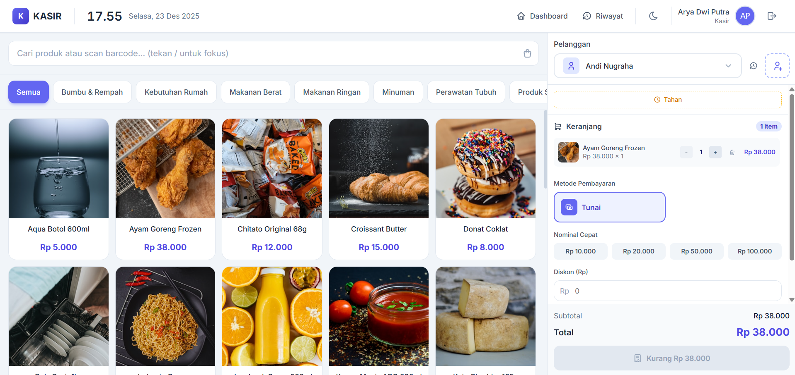
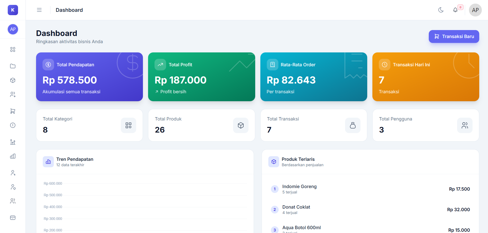
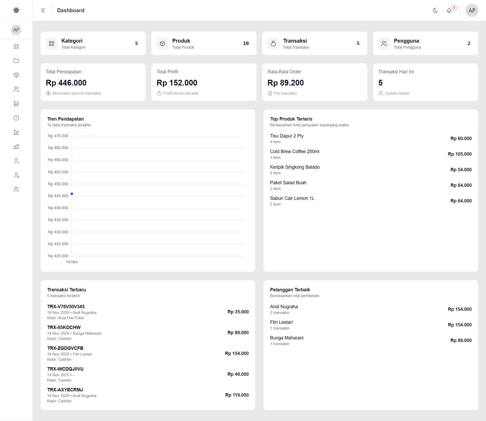
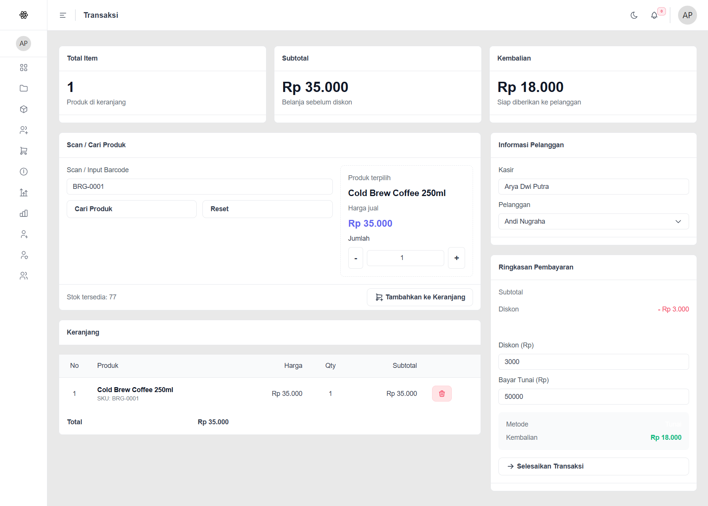
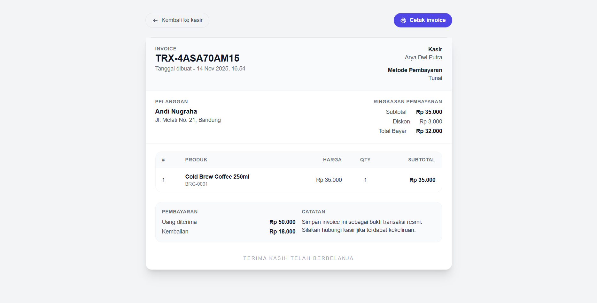

# Point of Sales

Sistem kasir berbasis Laravel + Inertia + React untuk transaksi penjualan, customer management, inventory audit, sales return, cashier shift, receivables, payables, dan observability operasional.



## Daftar Isi

- [Tentang Aplikasi](#tentang-aplikasi)
- [What's New](#whats-new)
- [Kenapa Menarik](#kenapa-menarik)
- [Fitur Utama](#fitur-utama)
- [Teknologi Inti](#teknologi-inti)
- [Quick Start](#quick-start)
- [Konfigurasi Awal](#konfigurasi-awal)
- [Default Login](#default-login)
- [Dokumentasi Detail](#dokumentasi-detail)
- [Cuplikan Layar](#cuplikan-layar)
- [Peta Modul Utama](#peta-modul-utama)
- [Testing](#testing)
- [Troubleshooting Umum](#troubleshooting-umum)
- [Kontribusi](#kontribusi)

## Tentang Aplikasi

Repo ini ditujukan untuk developer yang ingin menjalankan, memelihara, atau mengembangkan aplikasi POS dengan modul operasional yang cukup lengkap:

- POS & checkout multi-metode pembayaran
- customer + wilayah Indonesia
- receivables / piutang pelanggan
- payables / hutang supplier
- stock opname + stock mutation
- sales return
- cashier shift
- audit log
- laporan dan dokumen cetak
- RBAC berbasis role & permission

`README.md` ini sengaja dibuat ringkas sebagai portal onboarding. Penjelasan detail modul tersedia di folder `docs/`.

## What's New

- Hutang & piutang untuk pelanggan dan supplier
- Sales return terhubung ke stok, profit, dan receivable
- Stock opname dan stock mutation untuk audit inventory
- Cashier shift dengan kontrol shift aktif pada operasi transaksi
- Audit log untuk jejak perubahan operasional
- Payment workflow: cash, transfer bank, Midtrans, Xendit, dan pay later

## Kenapa Menarik

- POS cepat dan modern untuk operasional kasir harian
- Modul operasional toko tidak berhenti di checkout, tetapi lanjut ke receivables, payables, returns, dan inventory audit
- Role & permission cukup granular untuk kebutuhan admin dan kasir
- Dokumen bisnis siap cetak: invoice, receipt, shipping label, PDF piutang, PDF hutang
- Sudah ada struktur service dan module yang cukup enak dikembangkan oleh developer lain

## Fitur Utama

### POS & Transaksi

- pencarian produk via barcode / keyword
- cart multi-item
- hold / resume transaksi
- checkout multi-metode pembayaran
- share invoice publik dan dokumen print

### Customer & Wilayah

- CRUD customer
- alamat wilayah Indonesia
- customer history

### Inventory & Operasional

- product management
- stock opname
- stock mutation
- sales return
- cashier shift
- low stock notification

### Keuangan

- receivables / piutang pelanggan
- payables / hutang supplier
- supplier management
- payment gateway settings
- bank account management

### Admin & Observability

- users, roles, permissions
- audit logs
- sales report
- profit report
- dokumen PDF operasional

## Teknologi Inti

- [Laravel 12](https://laravel.com)
- [Inertia.js](https://inertiajs.com) + [React](https://react.dev)
- [Tailwind CSS](https://tailwindcss.com)
- [Spatie Laravel Permission](https://spatie.be/docs/laravel-permission)
- [Laravolt Indonesia](https://github.com/laravolt/indonesia)
- [barryvdh/laravel-dompdf](https://github.com/barryvdh/laravel-dompdf)
- [picqer/php-barcode-generator](https://github.com/picqer/php-barcode-generator)
- Integrasi payment Midtrans & Xendit

## Quick Start

```bash
git clone https://github.com/aryadwiputra/point-of-sales.git
cd point-of-sales
cp .env.example .env
composer install
npm install
php artisan key:generate
php artisan migrate --seed
php artisan storage:link
npm run dev
php artisan serve
```

Dokumentasi setup lengkap: `docs/getting-started.md`

## Konfigurasi Awal

Setelah login pertama kali, lakukan minimal konfigurasi berikut:

1. lengkapi profil toko
2. atur payment gateway yang dipakai
3. tambah rekening bank aktif jika memakai transfer manual
4. isi target penjualan bila dashboard target dipakai
5. pastikan `APP_URL` valid jika memakai webhook Midtrans/Xendit

Dokumentasi detail konfigurasi: `docs/configuration.md`

## Default Login

- Admin: `arya@gmail.com` / `password`
- Kasir: `cashier@gmail.com` / `password`

Catatan:

- seeder akan membuat role, permission, user default, dan sample data
- jika menjalankan ulang seeder, permission cache perlu konsisten; lihat troubleshooting di bawah

## Dokumentasi Detail

### Handbook Utama

- Indeks dokumentasi: `docs/README.md`
- Getting started: `docs/getting-started.md`
- Gambaran arsitektur: `docs/architecture-overview.md`
- Konfigurasi aplikasi: `docs/configuration.md`
- Indeks fitur: `docs/feature-index.md`

### Dokumen Fitur

- POS & transaksi: `docs/features/pos-transactions.md`
- Customer & wilayah: `docs/features/customers-regions.md`
- Receivables: `docs/features/receivables.md`
- Payables & suppliers: `docs/features/payables-suppliers.md`
- Inventory & stock: `docs/features/inventory-stock.md`
- Sales returns: `docs/features/sales-returns.md`
- Cashier shifts: `docs/features/cashier-shifts.md`
- Audit logs: `docs/features/audit-logs.md`
- Settings & payments: `docs/features/settings-payments.md`
- RBAC, users, roles: `docs/features/rbac-users-roles.md`
- Reports & documents: `docs/features/reports-documents.md`

## Cuplikan Layar

### Modul Revamp

| Modul | Preview |
| ----- | ------- |
| Dashboard |  |
| Kasir / POS |  |

### Modul Legacy / Dokumen

| Modul | Preview |
| ----- | ------- |
| Dashboard Lama |  |
| POS Lama |  |
| Invoice |  |

Catatan:

- preview ini dipertahankan di README untuk membantu developer cepat menangkap kualitas UI dan cakupan modul
- dokumentasi detail perilaku fitur tetap dipisah ke folder `docs/`

## Peta Modul Utama

- `dashboard/transactions` — POS, cart, hold/resume, checkout, print
- `dashboard/transactions/history` — histori transaksi dan entry point sales return
- `dashboard/customers` — customer management dan data wilayah
- `dashboard/receivables` — piutang pelanggan
- `dashboard/suppliers` — supplier management
- `dashboard/payables` — hutang supplier
- `dashboard/stock-opnames` — stock opname
- `dashboard/stock-mutations` — histori mutasi stok
- `dashboard/sales-returns` — retur penjualan
- `dashboard/cashier-shifts` — buka/tutup shift kasir
- `dashboard/audit-logs` — observability aktivitas user
- `dashboard/settings/*` — payment settings, bank accounts, profil toko, target

## Testing

Contoh menjalankan test:

```bash
php artisan test
php artisan test --filter=StockOpnameTest
php artisan test --filter=SalesReturnTest
php artisan test --filter=AuditLogTest
```

Dokumen fitur menjelaskan test coverage yang relevan per modul.

## Troubleshooting Umum

### Permission baru tidak terbaca setelah seeding

- jalankan ulang seeder utama: `php artisan db:seed`
- logout lalu login lagi
- pastikan seeder permission/role/user sudah ikut mereset cache permission

Detail RBAC: `docs/features/rbac-users-roles.md`

### Route fitur baru error karena migrasi belum dijalankan

Jika route seperti sales return, stock opname, cashier shift, atau audit log gagal karena tabel belum ada:

```bash
php artisan migrate
```

### Webhook payment tetap pending

- cek `APP_URL` jangan `localhost`
- pastikan webhook URL yang dipakai public
- cek token callback Xendit dan key Midtrans

Detail payment setup: `docs/configuration.md`

### Gambar produk tidak tampil

Pastikan symbolic link storage sudah dibuat:

```bash
php artisan storage:link
```

## Kontribusi

1. Fork repo ini
2. Buat branch fitur: `git checkout -b feature/nama-fitur`
3. Lakukan perubahan
4. Commit dengan message jelas
5. Push branch dan buka Pull Request

## Authors

- [Arya Dwi Putra](https://www.github.com/aryadwiputra)
- Menggunakan resource awal dari https://github.com/Raf-Taufiqurrahman/RILT-Starter dengan penyesuaian untuk aplikasi POS
